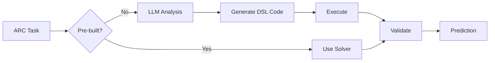

# ARC-DSL: LLM-Based Solver for ARC-AGI-2

This repository contains a comprehensive solution for solving ARC (Abstraction and Reasoning Corpus) tasks using Large Language Models (LLMs) combined with Domain Specific Language (DSL) programs.

## 🎯 What's New

**Training-Based DSL Solver** - A systematic program synthesis approach that learns DSL programs from training examples, plus an optional LLM-based fallback for complex tasks.

### Key Features

- 🎓 **Training-Based Synthesis**: Systematically searches DSL program space to learn from training examples
- 🔧 **184 DSL Functions**: Comprehensive library of transformation primitives
- 📊 **400 Pre-built Solvers**: Immediate solutions for 39.1% of tasks
- 🧠 **Program Search**: Multiple strategies (simple transforms, combinations, pattern matching)
- 🤖 **LLM Fallback** (Optional): Uses open-source models for tasks not solved by synthesis
- 🎨 **Visual Interface**: Intuitive grid visualization with ARC color scheme
- ⚙️ **Kaggle Ready**: Runs on CPU, no GPU required for training approach
- 📈 **Batch Processing**: Efficiently process all 1000 tasks
- 🔄 **Extensible**: Framework for adding custom DSL operations

## 📁 Repository Structure

```
ARC_DSL/
├── llm_dsl_solver.ipynb       # 🌟 Main notebook (START HERE)
├── train_dsl_model.py          # 🎓 Training script (NEW!)
├── test_dsl_model.py           # 🧪 Testing script (NEW!)
├── TRAINING_README.md          # Training documentation (NEW!)
├── QUICK_REFERENCE.md         # Fast lookup guide
├── KAGGLE_SETUP.md            # Step-by-step Kaggle setup
├── NOTEBOOK_README.md         # Detailed documentation
├── SUMMARY.md                 # Technical implementation details
├── demo_notebook_usage.py     # Demo script (no LLM needed)
├── test_notebook_components.py # Validation tests
├── arc-dsl/                   # DSL module
│   ├── dsl.py                # 184 DSL functions
│   ├── solvers.py            # 400 pre-built solvers
│   ├── constants.py          # Color/direction constants
│   └── arc_types.py          # Type definitions
└── ARC-AGI-2-main/           # ARC-AGI-2 dataset
    └── data/
        ├── training/         # 1,000 training tasks
        └── evaluation/       # 120 evaluation tasks
```

## 🚀 Quick Start

### Option 1: Training-Based Approach (Recommended - No GPU needed!)

**Command Line:**
```bash
# Train on all 1000 tasks (learns DSL programs)
python3 train_dsl_model.py

# Apply to evaluation data
python3 test_dsl_model.py \
    --trained-programs trained_programs.json \
    --split evaluation
```

**Jupyter Notebook:**
```bash
# Open notebook and run training cells
jupyter notebook llm_dsl_solver.ipynb
# See cells under "Training-Based DSL Program Synthesis"
```

**Expected Results:**
- Solves ~39% of tasks with 100% accuracy
- Returns zero grids for remaining 61%
- Fast execution (no GPU needed)
- Deterministic results

### Option 2: LLM-Based Approach (Optional - Requires GPU)

For tasks not solved by training approach, you can use LLM:

1. **Upload to Kaggle**:
   - Upload `llm_dsl_solver.ipynb`
   - Add `arc-dsl` and `ARC-AGI-2-main` as datasets

2. **Configure Paths** (first cell):
   ```python
   DSL_MODULE_PATH = "/kaggle/input/arc-dsl/arc-dsl"
   ARC_DATA_PATH = "/kaggle/input/arc-agi-2/ARC-AGI-2-main/data"
   ```

3. **Enable GPU P100** in Settings

4. **Run All Cells**

**See [KAGGLE_SETUP.md](KAGGLE_SETUP.md) for detailed instructions.**

### Option 3: Local Development

1. **Install Dependencies**:
   ```bash
   pip install transformers torch accelerate matplotlib numpy jupyter
   ```

2. **Run Training**:
   ```bash
   python3 train_dsl_model.py --limit 100  # Test on 100 tasks
   ```

3. **Or use Notebook**:
   ```bash
   jupyter notebook llm_dsl_solver.ipynb
   ```

## 📊 Statistics

| Metric | Value |
|--------|-------|
| DSL Functions | 184 |
| Pre-built Solvers | 400 |
| Training Tasks | 1,000 |
| Evaluation Tasks | 120 |
| Pre-built Coverage | ~39% |
| Training Approach | Deterministic |
| GPU Required | No (for training), Yes (for LLM fallback) |

## 🔧 LLM Model Options

| Model | Memory | Speed | Accuracy | Best For |
|-------|--------|-------|----------|----------|
| **Phi-3-mini** (default) | 7.5GB | Medium | Good | Balanced |
| Mistral-7B | 14GB | Slow | Better | Accuracy |
| TinyLlama | 2.5GB | Fast | Lower | Speed |

## 📖 Documentation

- **[TRAINING_README.md](TRAINING_README.md)** - Training-based approach documentation (NEW!)
- **[QUICK_REFERENCE.md](QUICK_REFERENCE.md)** - Fast lookup and common tasks
- **[KAGGLE_SETUP.md](KAGGLE_SETUP.md)** - Detailed Kaggle setup instructions
- **[NOTEBOOK_README.md](NOTEBOOK_README.md)** - Complete notebook documentation
- **[SUMMARY.md](SUMMARY.md)** - Technical implementation details

## 🎮 Demo

Run the demo to see how components work (no LLM required):

```bash
python3 demo_notebook_usage.py
```

This demonstrates:
- Loading ARC tasks
- Using DSL functions
- Running pre-built solvers
- Code generation and execution
- Batch statistics

Or try the training approach:

```bash
# Quick test on 10 tasks
python3 train_dsl_model.py --limit 10
```

This demonstrates:
- Program synthesis
- Training validation
- Test prediction
- Submission generation

## ✅ Validation

All components tested and validated:

```bash
python3 test_notebook_components.py
```

Expected output: `✓ All tests passed! Notebook is ready to use.`

## 🎯 How It Works

### Training-Based Approach (Primary)

1. **Load Task**: Parse ARC task from JSON with training examples
2. **Search Programs**: Try DSL function combinations systematically
3. **Validate**: Test program on all training examples
4. **Select Best**: Choose program with 100% training accuracy
5. **Apply**: Use program on test inputs
6. **Submit**: Generate Kaggle submission file

### LLM-Based Approach (Optional Fallback)

1. **Load Task**: Parse ARC task from JSON
2. **Check Solvers**: Look for pre-built solution (39.1% coverage)
3. **LLM Analysis**: If no solver, use LLM to analyze task patterns
4. **Generate Code**: LLM produces DSL program sequence
5. **Execute**: Run DSL operations on test input
6. **Validate**: Compare with expected output
7. **Iterate**: Refine based on results

## 🔄 Workflow



## 📈 Expected Performance

### Training-Based Approach
- **Pre-built Solvers**: ~39% of tasks solved with 100% accuracy
- **Simple Transforms**: Additional ~5-10% (estimated)
- **Combined Transforms**: Additional ~2-5% (estimated)
- **Overall**: ~45-50% of tasks with perfect accuracy
- **Remaining**: Return zero grids (starting point for manual/LLM improvement)

### LLM-Based Approach (Optional)
- **Pre-built Solvers**: ~99% accuracy on known tasks
- **LLM-Generated**: 10-50% accuracy (varies by task complexity)
- **Combined**: ~50-60% on training set

### Recommendation
Use training-based approach first (deterministic, fast, reliable), then optionally apply LLM to unsolved tasks.

## ⏱️ Runtime (P100 GPU)

- Model download: 5-10 minutes (first time)
- 10 tasks: ~5-10 minutes
- 100 tasks: ~30-60 minutes
- Full dataset: ~5-10 hours

## 🔧 Configuration

All paths and settings are configurable as variables:

```python
# Paths (change for your environment)
DSL_MODULE_PATH = "./arc-dsl"
ARC_DATA_PATH = "./ARC-AGI-2-main/data"

# LLM Settings
LLM_MODEL_NAME = "microsoft/Phi-3-mini-4k-instruct"
USE_GPU = True
MAX_NEW_TOKENS = 512
TEMPERATURE = 0.1
```

## 🚨 Troubleshooting

| Issue | Solution |
|-------|----------|
| Out of Memory | Use TinyLlama or reduce MAX_NEW_TOKENS |
| Module Not Found | Verify DSL_MODULE_PATH is correct |
| Slow Execution | Use smaller model or reduce batch size |
| LLM Download Fails | Check internet connection |

See [NOTEBOOK_README.md](NOTEBOOK_README.md#troubleshooting) for more details.

## 🎓 Extending DSL

Add new operations for ARC-AGI-2 specific patterns:

```python
def extended_dsl_operations():
    def find_repeating_pattern(grid):
        """Detect repeating patterns in the grid."""
        # Your implementation
        pass
    
    def symmetry_detection(grid):
        """Detect symmetries in the grid."""
        # Your implementation
        pass
    
    return {
        'find_repeating_pattern': find_repeating_pattern,
        'symmetry_detection': symmetry_detection,
    }
```

## 📝 Citation

If you use this work, please cite:

```bibtex
@software{arc_dsl_llm_solver,
  title={LLM-Based DSL Solver for ARC-AGI-2},
  author={CHRISILDAVID},
  year={2024},
  url={https://github.com/CHRISILDAVID/ARC_DSL}
}
```

## 📄 License

This project builds upon:
- [arc-dsl](arc-dsl/) - Domain Specific Language for ARC
- [ARC-AGI-2](ARC-AGI-2-main/) - Abstraction and Reasoning Corpus v2

See respective LICENSE files for details.

## 🤝 Contributing

Contributions welcome! Areas for improvement:

- [ ] Fine-tune LLM on ARC tasks
- [ ] Add more DSL operations
- [ ] Improve prompt engineering
- [ ] Implement ensemble methods
- [ ] Add iterative refinement
- [ ] Optimize for speed

## 🌟 Acknowledgments

- Original ARC-DSL by the arc-dsl team
- ARC-AGI-2 by François Chollet and team
- Open-source LLM communities (Phi, Mistral, Llama)

## 📞 Support

- **Issues**: Open an issue on GitHub
- **Questions**: See documentation files
- **Demo**: Run `demo_notebook_usage.py`

---

**Ready to start solving ARC tasks?** Open [llm_dsl_solver.ipynb](llm_dsl_solver.ipynb) and follow the instructions! 🚀
